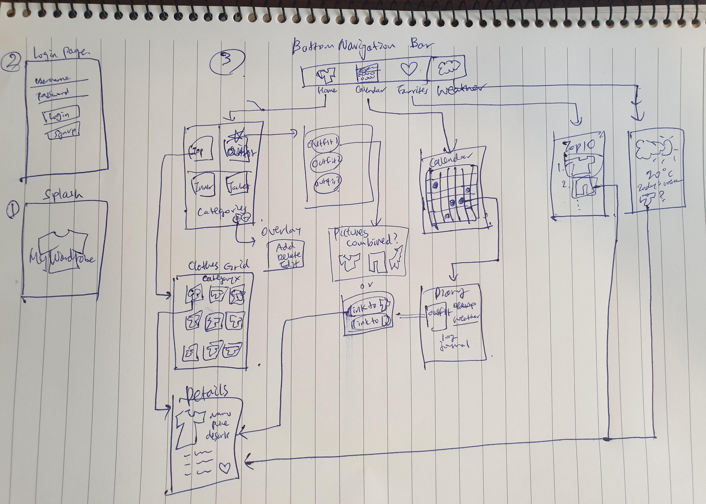

Original App Design Project - README Template
===

# Closet/Wardrobe App

## Table of Contents
1. [Overview](#Overview)
1. [Product Spec](#Product-Spec)
1. [Wireframes](#Wireframes)
2. [Schema](#Schema)

## Overview
### Description
Virtual closet where you can store and organize clothes, and save outfits, and get recommendations based on today's weather

### App Evaluation
- **Category:** Clothes, Organizer, social networking
- **Mobile:** Camera used to post pic of clothes. Easy access to virtual closet, can prepare for what to wear whenever/wherever, instantly log clothes combination ideas
- **Story:** Allows users to add, organize, categorize, share clothes they have in their real closet, helps user keep track of what type of clothes and the location of where they had stored their clothes in real closet. Allows users to save clothes combination. Platform where they can share daily outfits with friends, give recommendations, exchange clothes.
- **Market:** Anyone (esp targeted for college students with limited space in their real closet, easy to lose clothes, buy too many clothes, etc)
- **Habit:** frequent usage, thinking of what to wear is essential part of daily routine
- **Scope:** keeping record of clothes -> simple, making it a social media platform -> complex

## Product Spec

### 1. User Stories (Required and Optional)

**Required Must-have Stories**
* [ ] User can log in/out using gmail/fb account (use Google/FB SDK)
* [ ] User can sign up
* [ ] The current signed in user is persisted across app restarts
* [ ] User can take pictures/load pictures from gallery
* [ ] User can save pictures of their clothes into different categories
* [ ] User can add/delete categories
* [ ] User can add/delete/edit clothes
* [ ] User can select clothes and create a custom outfit combination
* [ ] User can view today's weather
* [ ] User can get recommendations for what to wear based on the weather
* [ ] User can view calendar
* [ ] User can log their outfits on specific days on the calendar
* [ ] User can click on the clothes to see more detail (description, location, price, etc)
* [ ] User can see the TOP 10 clothes they wear most often (ranking, sorting)
* [ ] User can add "favorites"

**Optional Nice-to-have Stories**
* [ ] Pretty UI
* [ ] Delete background for clothes pictures
* [ ] AR/XR features
* [ ] AI recommendations
* [ ] Social media features (post, share, like, comment on others' closets/outfits)
* [ ] Marketplace (users can exchange/buy clothes from others)

### 2. Screen Archetypes
* Login / Register
  * User can log in/out
  * User can sign up
* Home
  * User can view categories
  * User can save pictures of their clothes into different categories
  * User can add/delete categories
  * User can view today's weather
  * User can get recommendations for what to wear based on the weather
* Category X (specific category)
  * User can add/delete/edit clothes
  * User can select "favorites"
* Detail
  * User can click on the clothes to see more detail (description, location, price, etc)
* Outfit Creation
  * User can select clothes and create a custom outfit combination
* Calendar
  * User can view calendar
  * User can log their outfits on specific days on the calendar
* Favorites
  * User can view "favorites"
* Ranking
  * User can see the TOP 10 clothes they wear most often (ranking, sorting)

### 3. Navigation

**Tab Navigation** (Tab to Screen)
This is when the user switches between screens by simply clicking on a tab displayed at the top or bottom of the app.

* Home
* Calendar
* Favorites

**Flow Navigation** (Screen to Screen)
This is when the user taps on something on a screen and is taken to another screen. From that screen, they can go back to the previous screen, or navigate to another screen.

* Login / Register
  => Home
* Home
  => Category X
  => Calendar
  => Favorites
  => Ranking
* Category X (specific category)
  => Detail
  => Home
* Detail
  => Category X
* Outfit Creation
* Calendar
  => Home
* Favorites
  => Home
* Ranking
  => hOME

## Wireframes


### [BONUS] Digital Wireframes & Mockups

### [BONUS] Interactive Prototype

## Schema 
### Models
#### User
   | Property      | Type     | Description |
   | ------------- | -------- | ------------|
   | objectId      | String   | unique id for the user post (default field) |
   | username      | String   | name of owner of wardrobe |
   | password      | String   | password    |
   | createdAt     | DateTime | date when post is created (default field) |
   | updatedAt     | DateTime | date when post is last updated (default field) |

#### Clothing
   | Property      | Type     | Description |
   | ------------- | -------- | ------------|
   | objectId      | String   | unique id for the user post (default field) |
   | owner         | Pointer to User|  owner of clothing |
   | category      | String   | name of category |
   | image         | File     | image of clothing |
   | clothingName  | String   | name of clothing |
   | description   | String   | description for clothing |
   | price         | Number   | cost of clothing |
   | brand         | String   | name of brand |
   | favorite      | Boolean  | favoried or not |
   | createdAt     | DateTime | date when post is created (default field) |
   | updatedAt     | DateTime | date when post is last updated (default field) |

#### Outfit
   | Property      | Type     | Description |
   | ------------- | -------- | ------------|
   | objectId      | String   | unique id for the user post (default field) |
   | clothes       | Array    | list of clothes that make up the outfit |
   | image (?)     | File     | image of outfit |
   | outfitName    | String   | name of outfit |
   | outfitDescription   | String   | description for outfit |
   | count         | Number   | number of times outfit has been worn | 
   | createdAt     | DateTime | date when post is created (default field) |
   | updatedAt     | DateTime | date when post is last updated (default field) |


### Networking
CRUD: Create, Read, Update, Delete
- Login / Register Screen
  - (Create/POST) Creates new USER when sign up
- Home Screen
  - (Create/POST) Add category
  - (Delete) Delete category
  - (Update/PUT) Change name of category
  - (Read/GET) User can view today's weather
  - (Read/GET) User can get recommendations for what to wear based on the weather
- Category X Screen
  - (Create/POST) Add clothing
  - (Delete) Delete clothing
  - (Update/PUT) Change name of clothing
  - (Read/GET) User can view image of clothing
  - (Update/PUT) User can select "favorites"
- Details Screen
  - (Read/GET) User can view descriptiong of clothing
- Outfit Creation Screen
  - (Read/GET & Create/POST) User can select clothes and create a custom outfit combination
- Calendar Screen
  - (Read/GET) User can view calendar
  - (Update/PUT) User can log their outfits on specific days on the calendar, update frequency count for outfit
- Favorites Screen
  - (Read/GET) User can view "favorites"
- Ranking Screen
  - (Read/GET) User can see the TOP 10 clothes they wear most often (ranking, sorting)

example:
   - Home Feed Screen
      - (Read/GET) Query all posts where user is author & 
         ```swift
         let query = PFQuery(className:"Post")
         query.whereKey("author", equalTo: currentUser)
         query.order(byDescending: "createdAt")
         query.findObjectsInBackground { (posts: [PFObject]?, error: Error?) in
            if let error = error { 
               print(error.localizedDescription)
            } else if let posts = posts {
               print("Successfully retrieved \(posts.count) posts.")
           // TODO: Do something with posts...
            }
         }
         ```
      - (Create/POST) Create a new like on a post
      - (Delete) Delete existing like
      - (Create/POST) Create a new comment on a post
      - (Delete) Delete existing comment
   - Create Post Screen
      - (Create/POST) Create a new post object
   - Profile Screen
      - (Read/GET) Query logged in user object
      - (Update/PUT) Update user profile image

#### [OPTIONAL:] Existing API Endpoints
##### An API 
- https://rapidapi.com/blog/access-global-weather-data-with-these-weather-apis/
- https://developer.accuweather.com/

example:
- Base URL - [http://www.anapioficeandfire.com/api](http://www.anapioficeandfire.com/api)

   HTTP Verb | Endpoint | Description
   ----------|----------|------------
    `GET`    | /characters | get all characters
    `GET`    | /characters/?name=name | return specific character by name
    `GET`    | /houses   | get all houses
    `GET`    | /houses/?name=name | return specific house by name
